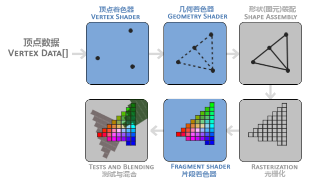

#+TITLE: OpenGL Graphics Pipeline
#+AUTHOR: Chuck
#+DESCRIPTION: The OpenGL graphics pipeline is a sequence of processing steps that converts 3D vertex coordinates and data into a 2D colored image on your screen.
#+KEYWORDS: Computer Vision, OpenGL GLSL
#+DATE: <2026-06-27 Sat 14:30>

The OpenGL graphics pipeline is a sequence of processing steps that converts 3D vertex coordinates and data into a 2D colored image on your screen. It handles everything from transforming 3D models and applying lighting to rasterizing shapes and calculating individual pixel colors.

OpenGL 图形渲染流水线的每个阶段如下图所示，蓝色部分为可编程部分，使用 OpenGL 着色器语言 GLSL (OpenGL Shading Language)。

顶点着色器，它把一个单独的顶点作为输入。顶点着色器主要的目的是把 3D 坐标转为另一种 3D 坐标，同时顶点着色器允许我们对顶点属性进行一些基本处理。

几何着色器将一组顶点作为输入，这些顶点形成图元，并且能够通过发出新的顶点来形成新的(或其他)图元来生成其他形状。

图元装配阶段将顶点着色器（或几何着色器）输出的所有顶点作为输入，并将所有的点装配成指定图元的形状。

光栅化阶段把图元映射为最终屏幕上相应的像素，生成供片段着色器使用的片段。在片段着色器运行之前会执行裁切。裁切会丢弃超出你的视图以外的所有像素，用来提升执行效率。

片段着色器的主要目的是计算一个像素的最终颜色，这也是所有 OpenGL 高级效果产生的地方。通常，片段着色器包含 3D 场景的数据（比如光照、阴影、光的颜色等等），这些数据可以被用来计算最终像素的颜色。

测试与混合阶段检测片段的对应的深度值，用它们来判断这个像素是其它物体的前面还是后面，决定是否应该丢弃。这个阶段也会检查 alpha 值并对物体进行混合。所以，即使在片段着色器中计算出来了一个像素输出的颜色，在渲染多个三角形的时候最后的像素颜色也可能完全不同。

在现代 OpenGL 中，我们必须定义至少一个顶点着色器和一个片段着色器（因为 GPU 中没有默认的顶点/片段着色器）。几何着色器是可选的，通常使用它默认的着色器就行了。
