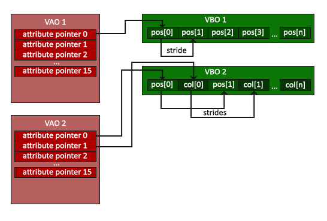
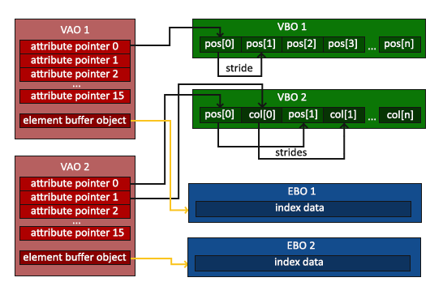

#+TITLE: OpenGL VAO and EBO
#+AUTHOR: Chuck
#+DESCRIPTION: 顶点数组对象(Vertex Array Object, VAO)可以像顶点缓冲对象那样被绑定，任何随后的顶点属性调用都会储存在这个VAO中。
#+KEYWORDS: Computer Vision, OpenGL
#+DATE: <2026-08-10 Mon 09:08>

顶点数组对象(Vertex Array Object, VAO)可以像顶点缓冲对象那样被绑定，任何随后的顶点属性调用都会储存在这个VAO中。

这样的好处就是，当配置顶点属性指针时，你只需要将那些调用执行一次，之后再绘制物体的时候只需要绑定相应的VAO就行了。这使在不同顶点数据和属性配置之间切换变得非常简单，只需要绑定不同的VAO就行了。

#+begin_quote
OpenGL的核心模式要求我们使用VAO，所以它知道该如何处理我们的顶点输入。如果我们绑定VAO失败，OpenGL会拒绝绘制任何东西。
#+end_quote

元素缓冲对象(Element Buffer Object，EBO)，也叫索引缓冲对象(Index Buffer Object，IBO)，是一个缓冲区，就像一个顶点缓冲区对象一样，它存储 OpenGL 用来决定要绘制哪些顶点的索引。

