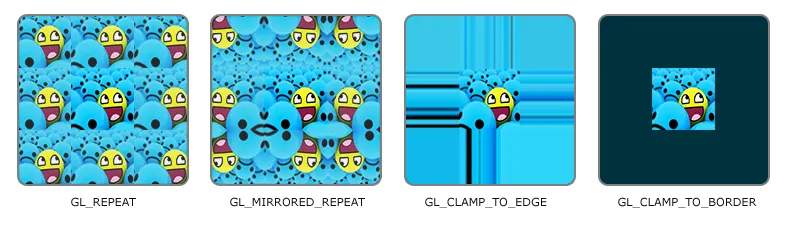
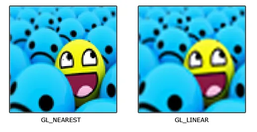
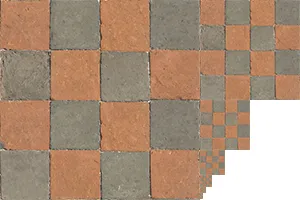

#+TITLE: OpenGL 纹理
#+AUTHOR: Chuck
#+DESCRIPTION: OpenGL 纹理（Texture）是一种将图像或数据映射到 3D 模型表面的技术，用来为图形添加丰富的细节和真实感。
#+KEYWORDS: Computer Vision, OpenGL
#+DATE: <2026-08-13 Thu 14:38>

OpenGL 纹理（Texture）是一种将图像或数据映射到 3D 模型表面的技术，用来为图形添加丰富的细节和真实感。

**纹理 (Texture)** ：本质上是一个包含像素/纹素（Texel）的向量数组。最常见的是 2D 图像，也可以是 1D、3D 或立方体贴图。

**纹理坐标 (Texture Coordinates)** ：用于确定图像上哪一部分该映射到物体的顶点上。通常使用 ~(S, T)~ 或 ~(U, V)~ 表示，范围是归一化的 ~[0.0, 1.0]~ （左下角为 ~(0,0)~ ，右上角为 ~(1,1)~ ）。

**采样 (Sampling)** ：片元着色器根据插值后的纹理坐标，从纹理对象中提取对应像素颜色的过程。

**纹理环绕方式 (Wrapping)** ：决定当纹理坐标超出 ~[0, 1]~ 范围时，OpenGL 如何绘制边缘（如 ~GL_REPEAT~ 重复、 ~GL_CLAMP_TO_EDGE~ 边缘拉伸）。

| 环绕方式              | 描述                                                                    |
|----------------------+-------------------------------------------------------------------------|
| ~GL_REPEAT~          | 对纹理的默认行为。重复纹理图像。                                             |
| ~GL_MIRRORED_REPEAT~ | 和 ~GL_REPEAT~ 一样，但每次重复图片是镜像放置的。                             |
| ~GL_CLAMP_TO_EDGE~   | 纹理坐标会被约束在0到1之间，超出的部分会重复纹理坐标的边缘，产生一种边缘被拉伸的效果。 |
| ~GL_CLAMP_TO_BORDER~ | 超出的坐标为用户指定的边缘颜色。                                             |

**纹理过滤 (Filtering)** ：控制当物体放大或缩小、纹理像素与屏幕像素不匹配时的采样算法。 ~GL_NEAREST~ （邻近过滤）：像素化风格，边缘硬朗。 ~GL_LINEAR~ （线性过滤）：平滑过渡，边缘模糊。

**多级渐远纹理 (Mipmap)** ：预先计算并存储一系列分辨率逐渐降低的纹理副本，用于解决远距离物体产生视觉杂波和性能浪费的问题。

| 过滤方式                     | 描述                                                        |
|-----------------------------+-------------------------------------------------------------|
| ~GL_NEAREST_MIPMAP_NEAREST~ | 使用最邻近的多级渐远纹理来匹配像素大小，并使用邻近插值进行纹理采样      |
| ~GL_LINEAR_MIPMAP_NEAREST~  | 使用最邻近的多级渐远纹理级别，并使用线性插值进行采样                 |
| ~GL_NEAREST_MIPMAP_LINEAR~  | 在两个最匹配像素大小的多级渐远纹理之间进行线性插值，使用邻近插值进行采样 |
| ~GL_LINEAR_MIPMAP_LINEAR~   | 在两个邻近的多级渐远纹理之间使用线性插值，并使用线性插值进行采样       |
