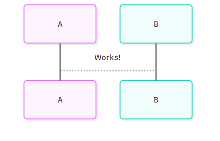

#+TITLE: Org Babel + Mermaid
#+AUTHOR: Chuck
#+DESCRIPTION: Org Babel 内置的语言已支持 PlantUML，在导出文件时可以生成各种图表；同样的，可以为 Org Babel 添加 Mermaid 语言支持。
#+KEYWORDS: Emacs, Org, Mermaid
#+DATE: <2026-10-09 Fri 14:03>

Org Babel 内置的语言已支持 PlantUML，在导出文件时可以生成各种图表；同样的，可以为 Org Babel 添加 Mermaid 语言支持。

1. 安装 [[https://github.com/mermaid-js/mermaid-cli][mermaid-cli]] :
   #+begin_src bash
   npm install -g @mermaid-js/mermaid-cli
   #+end_src
2. 安装 [[https://github.com/arnm/ob-mermaid][ob-mermaid]] 包，或者直接下载 ob-mermaid.el 文件保存到 User Lisp Directory 。
3. 确保 ~mmdc~ 在 PATH 路径下，或者指定路径：
   #+begin_src emacs-lisp
   (setq ob-mermaid-cli-path "mmdc")
   #+end_src
4. 添加配置文件 ~mermaid-config.json~ ，并通过 ~ob-mermaid-default-config-file~ 指定配置文件路径:
   #+begin_src json
   {
     "htmlLabels": false,
     "flowchart": { "htmlLabels": false }
   }
   #+end_src
   #+begin_src emacs-lisp
   (setq ob-mermaid-default-config-file "/path/to/mermaid-config.json")
   #+end_src
5. 添加 ~mermaid~ 到 ~org-babel-load-languages~ ：
   #+begin_src emacs-lisp
   (with-eval-after-load 'org
     (org-babel-do-load-languages
      'org-babel-load-languages
      '((mermaid . t))))
   #+end_src
6. 在 Org 文件中添加代码块：
   #+begin_src org
   ,#+begin_src mermaid :file mermaid-test.png
   sequenceDiagram
    A-->B: Works!
   ,#+end_src
   #+end_src
   

#+begin_quote
🔴 如果在导出过程中碰到类似 ~Error: Could not find chrome-headless-shell~ 的错误，可以通过环境变量指定浏览器的路径：
#+begin_src bash
export PUPPETEER_EXECUTABLE_PATH="/path/to/chrome"
#+end_src
~PUPPETEER_EXECUTABLE_PATH~ 是 Puppeteer 的一个环境变量，用于指定浏览器（如 Chrome 或 Chromium）的自定义二进制文件路径。
#+end_quote
